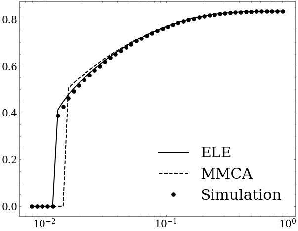

# ELE method for SIS model in simplicial complexes
This is a python implementation of ***ELE*** method for SIS model in higher-order networks, proposed in paper [Abrupt phase transition of epidemic spreading in simplicial complexes](https://arxiv.org/pdf/1910.03069.pdf). Besides, the ***MMCA*** method and ***Simulation*** codes are also provided for reproducing the results in the original paper, such as:



What's more, all the methods are implemented using `numba` and `multiprocessing`, resulting significant computational acceleration. 
## Packages Requirements
- pyhton >= 3.6
- networkx
- numba==0.55.1

## Using Example
You can reproduce the results in the picture above as well as the results for scale-free networks in the paper by simplly run:
```
python main.py
```
the results will be saved to dictionary `./results` as a dictionary.